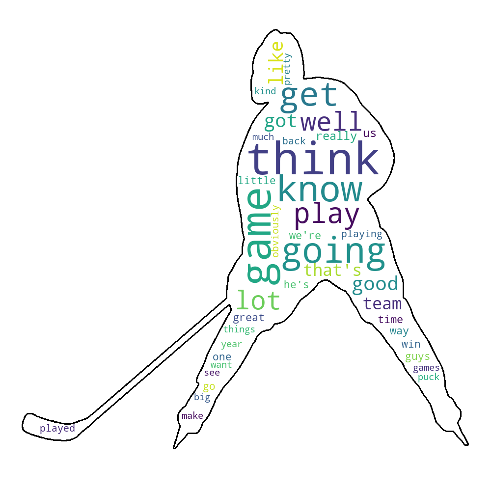
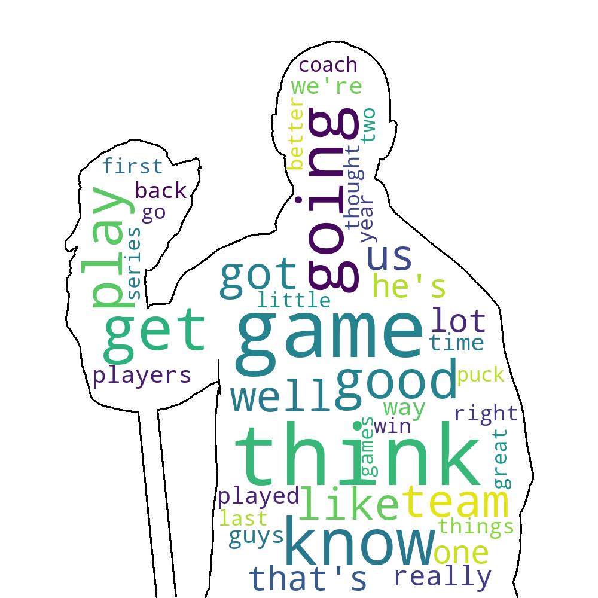
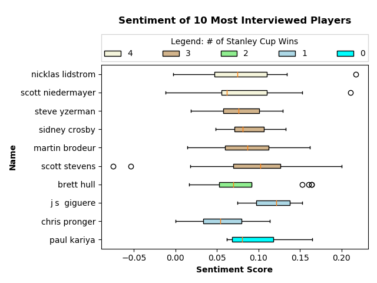
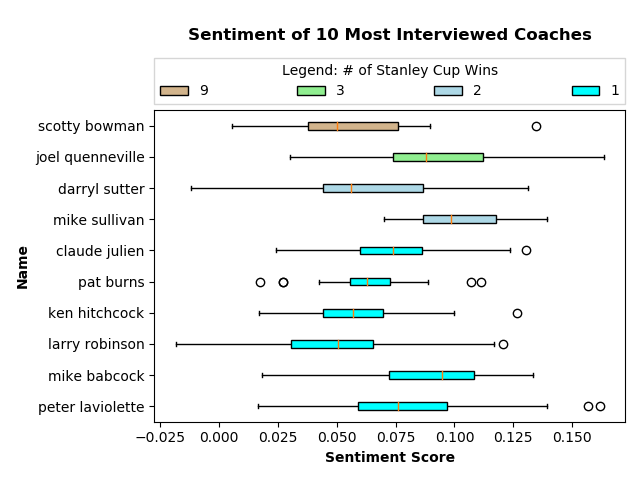
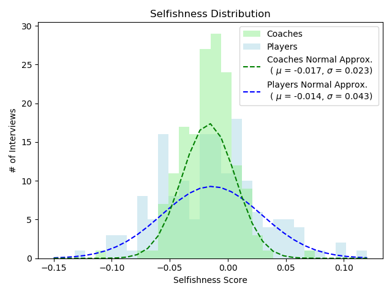
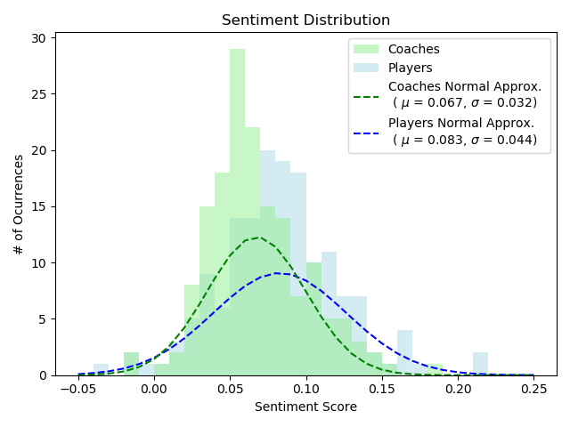

# InterviewAnalysis
Scripts and functions to scrape and analyze text from [ASAP Sports](http://www.asapsports.com/), a sports interview transcript site. Thus far the code is focused entirely on practice day interviews between National Hockey League Stanley Cup Final games. The resulting study can be found in [this](https://medium.com/analytics-vidhya/a-quantitative-study-of-nhl-interviews-25b28821364b) Analytics Vidhya __Medium post__. I've also published the [dataset on Kaggle](https://www.kaggle.com/dtamming/national-hockey-league-interviews).

Those whose sole interest is in the data itself need only to use data/interviews_clean.txt, although _utils.py_ provides useful helper functions. 

The functions (in bold below) that collect, clean, and access the data are well commented and written with other users in mind. 


### Python Files
___scraper.py___:
 - scrapes interview data from the hockey portion of the site
 
___clean.py___:
 - corrects inconsistencies in the website's data

___utils.py___:
 - helper functions for gathering the scraped data

_plotting.py_:
 - creates figures that shed light on the nature of these interviews 

### Data Files
data/interviews_raw.txt:
 - the scraped data

data/interviews_clean.txt:
 - the scraped data, cleaned using _clean.py_

### HTML Tag Formatting
Both of the data files are organized with html tagging in the following format shown below. There are a number of group interviews, so there are <answer> tags containing <name> and <text> children tags for each time an individual speaks during an interview. 
 
```html
<entry>
 <team1> </team1>
 <team2> </team2>
 <date> </date>
 <answer>
  <name> </name>
  <text> </text>
 </answer>
 <answer>
  <name> </name>
  <text> </text>
 </answer>
 ...
 ...
</entry>
```

### Figures
Several of the figures contained in this repo are shown below. They are explained in detail in the Medium post <!-- [Medium post](<medium url>) -->.







